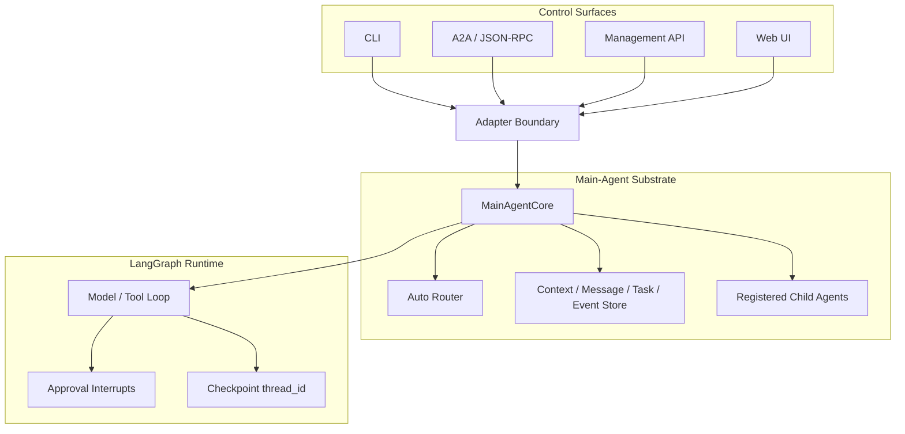
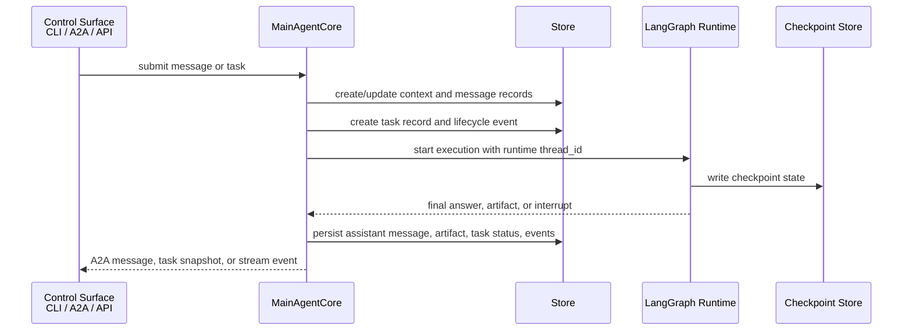
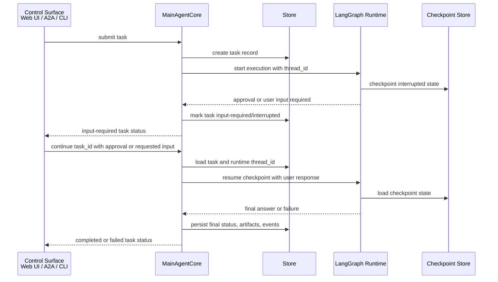

# Vermay

[English](README.md) | [简体中文](README.zh-CN.md)

Vermay is a local main-agent runtime built around the A2A protocol. It exposes a main agent that can:

- answer lightweight requests directly as messages;
- run local LangGraph-backed tasks with events, artifacts, approval interrupts, cancellation, and resume;
- route suitable requests to registered child A2A agents;
- provide a browser workbench for session transcripts, route diagnostics, task events, payload inspection, and approval controls.

Clients communicate with the agent through A2A JSON-RPC over the `/rpc` endpoint.

## Architecture

The project keeps protocol, task state, and runtime execution as separate layers.



Key identifiers:

| Concept | Meaning |
| --- | --- |
| `context_id` / `session_id` | Long-lived conversation/work context. |
| `message_id` | User or agent message identity inside a context. |
| `task_id` | The A2A `Task.id`: the external identity of one unit of work and its lifecycle. A2A clients and the Web UI use it to get, cancel, subscribe to, or resume that task. |
| `thread_id` | The LangGraph runtime `thread_id`: the checkpoint key for that task's graph execution. Vermay maps `task_id` to this value when it starts or resumes LangGraph; it is not an A2A task identifier or a conversation/session identifier. |

One session can contain many tasks, and each resumable task has its own `thread_id`. A runtime thread may appear in local CLI or inspector output for diagnosis, but A2A clients should identify and resume work with `task_id`. For an approval interrupt, `MainAgentCore` resolves `task_id` to `thread_id`, then resumes the checkpointed LangGraph execution.

### Task Execution Flow

Normal execution starts from a control surface, becomes a lifecycle-managed task, and then advances through the LangGraph runtime. Public task records and event streams stay outside the raw graph state.



### Input-Required Resume Flow

Approval and model-requested input interrupts keep `task_id` and `thread_id` separate. The caller continues the externally visible `task_id`; the main-agent layer looks up the internal checkpoint thread and resumes the runtime.



## Web UI

The Web UI is a chat-first Agent Console: sessions are on the left, the conversation transcript and composer are in the center, and the inspector for route diagnostics, task events, agent cards, child agents, and payloads is on the right.


The frontend lives in `web/` as a standalone Next.js app. It is colocated with the backend so A2A contracts, task events, approval flows, and inspector behavior can evolve together.

## Install

```bash
python3 -m venv .venv
source .venv/bin/activate
python -m pip install --upgrade pip
python -m pip install -e .
```

Python 3.11 or newer is required.

Contributors running tests should install the development extra instead:

```bash
python -m pip install -e ".[dev]"
```

## CLI Quick Start

```bash
vermay "weather forecast for Beijing"
```

The CLI prints progress to stderr and the final answer to stdout.

Disable progress output:

```bash
vermay "weather forecast for Beijing" --no-progress
```

## Start The Backend

```bash
source .venv/bin/activate
vermay serve
```

Defaults:

```text
host: 127.0.0.1
port: 8000
```

`serve` exposes the A2A service together with the first-party management and
diagnostic APIs used by the Web UI.

Health check:

```bash
curl http://127.0.0.1:8000/health
```

The service is local-only by default and does not add authentication. Be careful before binding it outside localhost.

## Start The Web UI

In another terminal:

```bash
cd web
pnpm install
pnpm dev
```

The web app defaults to `http://localhost:3000/agent` and proxies backend calls to `http://127.0.0.1:8000`.

Override the backend URL when needed:

```bash
VERMAY_API_BASE=http://127.0.0.1:8000 pnpm dev
```

## Runtime And Release Boundary

The supported `0.1.x` release is a source checkout or source archive. The Python backend and private Next.js frontend are built and operated as separate processes; the backend does not serve the frontend bundle. PyPI wheels, npm publication, container images, and a combined executable are not maintained release artifacts yet.

For a production-style local deployment, run `vermay serve` on localhost and run the built frontend with `pnpm build && pnpm start`. The backend has no built-in authentication and must not be exposed directly to an untrusted network. Secrets belong in environment variables or an untracked `.env`, while SQLite databases, checkpoints, traces, and generated proposals are runtime state rather than source-release content.

See [Runtime and Release Boundary](docs/runtime-and-release.md) for supported commands, persistence requirements, public service boundaries, and the release checklist.

Validate a clean source release with:

```bash
scripts/check_source_release.sh
```

## Full-Stack Regression

Run the deterministic backend and migrated-frontend regression gate:

```bash
scripts/check_full_stack_regression.sh
```

It does not require a live model or MCP server. See [Full-Stack Regression Baseline](docs/full-stack-regression.md) for the optional live E2E gate and the public error contract.

## Backend Smoke Checks

Run backend smoke checks against a configured local server:

```bash
scripts/a2a_dev_smoke.sh
```

## A2A JSON-RPC Examples

The `/rpc` endpoint accepts A2A JSON-RPC requests.

Send a direct message:

```bash
curl -X POST http://127.0.0.1:8000/rpc \
  -H 'Content-Type: application/json' \
  -d '{
    "jsonrpc": "2.0",
    "id": "req-1",
    "method": "SendMessage",
    "params": {
      "message": {
        "kind": "message",
        "role": "user",
        "messageId": "msg-1",
        "parts": [{"kind": "text", "text": "tell me a joke"}]
      },
      "metadata": {"executionMode": "message"}
    }
  }'
```

Run a task:

```bash
curl -X POST http://127.0.0.1:8000/rpc \
  -H 'Content-Type: application/json' \
  -d '{
    "jsonrpc": "2.0",
    "id": "req-2",
    "method": "SendMessage",
    "params": {
      "message": {
        "kind": "message",
        "role": "user",
        "messageId": "msg-2",
        "parts": [{"kind": "text", "text": "check k8s status"}]
      },
      "metadata": {"executionMode": "task"}
    }
  }'
```

Use auto routing:

```bash
curl -X POST http://127.0.0.1:8000/rpc \
  -H 'Content-Type: application/json' \
  -d '{
    "jsonrpc": "2.0",
    "id": "req-3",
    "method": "SendMessage",
    "params": {
      "message": {
        "kind": "message",
        "role": "user",
        "messageId": "msg-3",
        "parts": [{"kind": "text", "text": "delete pod nginx only after approval"}]
      },
      "metadata": {"executionMode": "auto"}
    }
  }'
```

Inspect a task:

```bash
curl -X POST http://127.0.0.1:8000/rpc \
  -H 'Content-Type: application/json' \
  -d '{"jsonrpc":"2.0","id":"req-4","method":"GetTask","params":{"id":"<task-id>"}}'
```

Cancel a task:

```bash
curl -X POST http://127.0.0.1:8000/rpc \
  -H 'Content-Type: application/json' \
  -d '{"jsonrpc":"2.0","id":"req-5","method":"CancelTask","params":{"id":"<task-id>","reason":"operator canceled"}}'
```

## Model Configuration

Models are configured in `config/models.json`.

```json
{
  "primary_model": "local_ollama",
  "router_model": "ollama_gemma4_31b",
  "models": {
    "local_ollama": {
      "provider": "ollama",
      "options": {
        "model": "deepseek-v4-flash:cloud",
        "base_url": "http://127.0.0.1:11434",
        "timeout_seconds": 120,
        "tool_calling": "native"
      }
    },
    "ollama_gemma4_31b": {
      "provider": "ollama",
      "options": {
        "model": "gemma4:31b-cloud",
        "base_url": "http://127.0.0.1:11434",
        "timeout_seconds": 120
      }
    }
  }
}
```

`primary_model` is used for normal message and task execution.

`tool_calling` selects how a model may return tool calls. The configured
primary Ollama model uses `native`: Task calls use Ollama's standard `tools`
and `tool_calls` fields, while direct messages without tools use normal plain
text. Use `prompt_json` only for an Ollama endpoint that cannot return native
tool calls, or `none` to suppress tool use for that model. OpenAI-compatible
models support `native` and `none`; the runtime never falls back between these
strategies automatically.

`router_model` is used by `executionMode=auto` to classify whether a request should become:

- `local_message`;
- `local_task`;
- `remote_agent`.

If `router_model` is omitted, the router uses `primary_model`. `VERMAY_ROUTER_MODEL` can temporarily override the configured router model for local experiments.

Use another configured model from the CLI:

```bash
vermay "weather forecast for Beijing" --model local_ollama
```

## MCP Tools, Resources, And Prompts

MCP server configuration lives in `config/mcp_servers.json`.

List configured capabilities:

```bash
vermay mcp list-servers
vermay mcp list-tools
vermay mcp list-resources --server k8s
vermay mcp list-prompts --server k8s
```

Configured MCP servers are inactive by default during agent runs. Select servers explicitly:

```bash
vermay "check k8s status" --mcp-server k8s
vermay "debug phzou-core service" --mcp-server k8s --mcp-prompt 'k8s-service-health-check?service=phzou-core&namespace=default'
```

Selected MCP tools are wrapped as LangChain `StructuredTool` instances with namespaced names such as `mcp__k8s__kubectl_get`. MCP tools require approval by default unless the server or tool is marked read-only.

The local Kubernetes MCP example is under `examples/mcp_servers/k8s/`. It uses the `VERMAY_SSH_*` environment configuration.

## Human Input And Approval

Dangerous tools pause execution and require explicit approval. When the model cannot continue without missing information, it can call the built-in `request_user_input` tool and pause with a structured prompt and optional choices.

In the Web UI, an input-required task renders either approval controls or a requested-input form directly in the transcript.

An A2A caller supplies requested input with another `SendMessage` request carrying the existing `taskId`. The main agent resumes the same LangGraph `thread_id` without routing or creating a new task.

In an interactive terminal, approval is prompted automatically:

```bash
vermay "delete pod nginx-5869d7778c-687rb"
```

Low-level checkpoint resume is still available through the CLI:

```bash
vermay --thread-id <thread-id> --resume-approval true --approval-reason "approved by operator"
```

This CLI command is a runtime-level operation: it resumes a LangGraph checkpoint directly by `thread_id`. A2A and Web UI flows operate at the protocol level and resume externally visible work by `task_id`.

LangGraph checkpoints are stored under `data/checkpoints/`.

## Memory

Memory is explicit and stored locally in SQLite.

```bash
vermay memory add "Prefer read-only Kubernetes inspection first." --tag k8s --tag preference
vermay memory list
vermay memory disable 1
```

Memory metadata is stored in `data/agent.sqlite`.

## Skills

Skills are markdown files under `skills/` with front matter:

```markdown
---
name: kubernetes-readonly-debug
description: Read-only Kubernetes status inspection.
triggers: k8s, kubernetes, pods, services
version: 0.1.0
---

Prefer read-only inspection before proposing a fix.
```

Common commands:

```bash
vermay skills list
vermay skills show kubernetes-readonly-debug
vermay skills propose-from-trace --trace traces/latest.jsonl
vermay skills approve <proposal-id>
```

Approved skills live in `skills/`. Generated proposals live in `data/skill_proposals/`.

## License

Vermay is released under the [MIT License](LICENSE).
