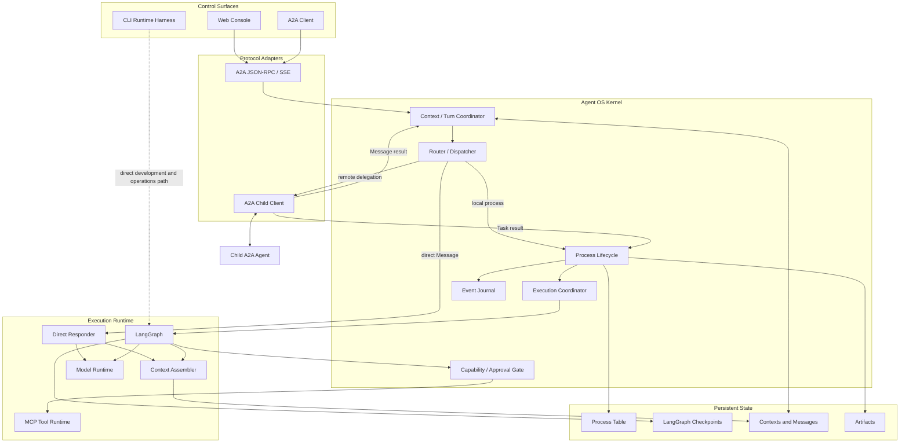

# Agent OS Architecture

## Status

This document defines the architectural direction for evolving Vermay into an Agent OS-style runtime. It is a vocabulary and target-architecture document, not the source of day-to-day milestone status.

Agent OS is an architectural lens for organizing agent workloads. It is not an operating system for managing hardware, and it does not replace A2A or LangGraph. It defines control-plane responsibilities around those technologies: process lifecycle, execution coordination, IPC, capabilities, persistence, and recovery. The analogy is useful only where it clarifies ownership; it is not a requirement to reproduce operating-system components one-for-one.

The current `vermay.main_agent.models.TaskRecord` is the backing record for what this document calls an `AgentProcessRecord`. This document does not require an immediate code or database rename. The API session projection also has a `TaskRecord`; it is a read model, not a second lifecycle owner.

For an assessment of the currently implemented runtime, including its safety
guarantees, liveness limitations, and staged evolution order, see
[current runtime assessment](runtime-refinement/current-architecture-assessment.md).
For active milestone status and acceptance criteria, see the
[runtime-refinement roadmap](runtime-refinement/roadmap.md). When this document
describes a future direction, the focused runtime contract and roadmap take
precedence for current behavior.
For feasibility, stage gates, and the sequence beyond current correctness work,
see the [runtime evolution path](runtime-refinement/runtime-evolution-path.md).

## Goals

- Give A2A Task, local task execution, LangGraph continuation, and Message distinct responsibilities.
- Define one internal source of truth for each locally owned durable process lifecycle.
- Keep A2A as the public IPC and task protocol.
- Keep LangGraph focused on graph execution and checkpoint continuation.
- Support direct messages without forcing every interaction into a durable task.
- Provide a stable model for local execution, remote delegation, interruption, cancellation, recovery, and inspection.

## Non-Goals

- Reimplementing operating-system primitives or managing hardware.
- Renaming all task-related code immediately.
- Introducing Agent OS terminology into the A2A wire protocol.
- Making LangGraph own queueing, public task identity, or distributed delegation.
- Treating every model invocation as a durable process.
- Creating a new service, class, table, or identifier for every operating-system analogy.
- Building fairness, quotas, distributed scheduling, or automatic recovery before a real workload requires them.
- Turning the current service into an in-process multi-profile agent hosting platform; registered child agents remain explicit external A2A peers.

## Complexity Guardrails

The Agent OS model defines responsibilities before it defines components. A conceptual boundary does not require a separately deployed service or even a new class.

The current implementation remains intentionally compact:

| Responsibility | Current implementation | Near-term action |
| --- | --- | --- |
| Service hosting | FastAPI app factory and lifecycle hooks | Keep one process boundary; do not add a private gateway protocol. |
| Context/turn coordination | `MainAgentCore` request preparation plus `MainAgentStore` | Causal ordering, route-specific character limits, and initial input cuts are implemented; add token-aware budgets only when needed. |
| Process lifecycle | `MainAgentCore` plus `MainAgentStore` | Transition validation and conservative startup recovery are implemented; broaden execution only with evidence. |
| Execution coordination | `InProcessTaskExecutor`, task submitter, durable queued commands, and per-task locks | Keep the bounded thread-pool implementation; do not add distributed scheduling yet. |
| Context assembly | `main_agent.context`, responder conversion, task-runner formatting, and `RuntimeContextProvider` | Explicit character-bounded policies are implemented; token-aware accounting remains evidence-driven. |
| Runtime continuation | `LangGraphAgentRuntime` and checkpoints | Keep protocol concepts outside the runtime. |
| Capability gate | Existing permission and approval flow | Keep it in-process; do not introduce a standalone manager. |
| Public IPC | A2A adapter and JSON-RPC/SSE routes | Clarify projection and event contracts. |

Add a new architectural component only when at least one of these conditions is true:

- a second implementation must share the boundary;
- correctness requires a single enforcement point;
- security isolation requires an explicit trust boundary;
- independent scaling or failure isolation is demonstrated by production use.

Program registries, advanced schedulers, resource quotas, distributed recovery, and broad internal renaming are deferred capabilities, not prerequisites for the current version.

### Current Delivery Constraint

The Agent OS vocabulary is a design map, not a feature backlog. During the
current rapid-development phase, Vermay remains a compact single-host
A2A main-agent runtime. An architecture term does not authorize a new service,
table, scheduler, workspace, sandbox, or framework layer by itself.

Add a new subsystem only when a current workflow exposes a concrete missing
correctness, safety, or operational boundary and a narrow extension of the
existing shape cannot solve it. R3-R5 remain conditional stages; they are not
the default next implementation sequence.

## Review Verdict

The technical direction is sound because it separates public protocol identity, durable application lifecycle, and runtime continuation instead of treating all three as one task abstraction. It also leaves direct Message handling lightweight and models delegated child Tasks explicitly.

Its extension path is adequate for additional runtimes, remote agents, capability policies, and stronger execution coordination because those concerns meet at narrow records and adapters rather than inheriting LangGraph or A2A types throughout the codebase.

The main complexity risk is literal implementation of the OS analogy. The current version should therefore strengthen existing boundaries rather than create an Agent OS framework. The phase list below remains a capability map; the runtime-refinement roadmap and evolution path determine which work is active and when a later capability is justified.

The recommended product and architecture position is:

> Vermay is an A2A-native main-agent runtime and inspectable process host. It is not a multi-channel personal-assistant product or a general multi-agent hosting framework.

This position is sufficiently distinct to justify the current architecture. It becomes diluted if the project starts copying channel breadth, plugin marketplaces, autonomous skill mutation, or in-process agent profiles before its protocol, process, context, and recovery semantics are reliable.

## Strategic Positioning

OpenClaw, Hermes, and Vermay overlap at the model/tool loop, but optimize for different system boundaries.

| Dimension | OpenClaw | Hermes | Vermay |
| --- | --- | --- | --- |
| Primary product | Long-lived personal-assistant gateway across messaging channels and devices. | General agent core exposed through CLI, gateway, API, and editor-facing adapters. | A2A-native main-agent service with direct answers, durable local execution, and external child-agent delegation. |
| Public interaction boundary | Typed private Gateway protocol over WebSocket, with channel adapters and control clients. | Product-specific CLI, gateway/API, and ACP surfaces around one agent core. | A2A JSON-RPC/SSE for agent interaction, plus a separate management/read-model surface where necessary. |
| Conversation unit | Session-oriented interactive runs, with detached work tracked separately. | Persisted sessions whose complete transcript is projected into bounded model context. | A2A Context containing Messages and zero or more A2A Tasks. |
| Durable work | Background task ledger for detached runs; normal chat does not necessarily create a task. | Agent sessions and delegated child execution, with persistence around the shared core. | Agent Process Record projected as an A2A Task; direct Messages remain ephemeral. |
| Delegation | Internal subagents, ACP agents, and parallel specialist lanes integrated into the gateway/session model. | Child agents with isolated context and toolsets; bounded results return to the parent. | Registered child agents are independent A2A peers; a child Task is represented by an explicit local remote-process proxy. |
| Runtime orchestration | Product-owned agent loop, queues, tools, channels, and automation. | Shared `AIAgent` loop and tool registry reused across surfaces. | LangGraph owns graph execution and checkpoints; the application layer owns routing, lifecycle, and A2A projection. |
| Operator experience | Assistant UX, channel delivery, automations, and broad capability integration. | Local agent UX, sessions, tools, delegation, and developer surfaces. | Conversation-first Web UI plus lifecycle, route, artifact, approval, and protocol inspection. |
| Current strength | Product breadth and a mature long-lived gateway/control plane. | Cohesive reusable agent core and broad local-agent capabilities. | Explicit protocol/process semantics, inspectable durable tasks, and standards-based external federation. |
| Current cost | A large product-specific gateway and capability surface. | Product-specific session/delegation semantics rather than an A2A-first public lifecycle. | Less channel and assistant-product breadth, plus responsibility for correct A2A lifecycle, recovery, and delegation semantics. |

Vermay's differentiators should remain concrete:

1. **A2A is the data-plane contract.** A2A Message, Task, status, artifact, continuation, cancellation, and subscription semantics are not wrapped behind a second proprietary agent protocol.
2. **Interactive and durable work are distinct.** A direct answer is an Ephemeral Invocation; operational or interruptible work is an Agent Process exposed as an A2A Task.
3. **State ownership is explicit.** Application process state, LangGraph execution outcome, and A2A TaskState have one-way mappings instead of sharing one overloaded status field.
4. **Delegation crosses a real service boundary.** Child agents retain their own Agent Card, task identity, runtime, persistence, and trust boundary.
5. **Inspection is part of the runtime product.** The Web UI is not only a chat client; it explains route choice, process lifecycle, approvals, artifacts, and protocol payloads.

These strengths make the project suitable as a reference runtime, embedded main-agent service, or controlled agent-integration foundation. They do not currently make it a replacement for OpenClaw or Hermes as an end-user personal assistant.

The most important current gaps are:

- token-aware Context budgeting, full prompt snapshots, and global tool-output limits beyond the implemented character-bounded policies;
- general execution timeouts, workspace lifecycle, arbitrary-command isolation,
  and lost-execution policy beyond R3.1's bounded SSH child-process control;
- caller authorization, approval binding, and execution isolation before non-local deployment;
- measured router quality and safe child-agent selection;
- remote-task continuation, idempotency, health, and failure reconciliation.

These are evaluation boundaries, not an immediate implementation queue. The
active roadmap determines whether evidence makes any one of them current work.

## External References And Adoption Boundary

OpenClaw and Hermes are reference implementations, not compatibility targets.

| Reference lesson | Vermay decision |
| --- | --- |
| OpenClaw uses one long-lived Gateway as the source of truth for channel routing and sessions. | Keep one long-lived Vermay service host, but retain A2A as its public protocol instead of creating a second private gateway protocol. |
| OpenClaw treats normal interactive turns and detached background tasks differently; its task ledger is not its scheduler. | Keep direct Messages lightweight and keep Agent Process records separate from execution coordination. |
| OpenClaw serializes agent runs per session and treats detached work as separately inspectable. | Add explicit Context ordering and immutable process input boundaries without serializing the entire lifetime of a background process. |
| Hermes runs one agent core behind CLI, gateway, API, and editor adapters. | Reuse runtime composition and policy code across surfaces, while allowing the low-level CLI runtime harness to remain a diagnostic path. |
| Hermes separates durable transcripts from bounded model context through compression and context policy. | Introduce a shared context-assembly contract before adding more memory or history features. |
| Both systems isolate delegated work and expose only bounded results to the parent context. | Keep child agents as explicit A2A boundaries and import final Messages/Artifacts, not raw child tool history. |
| Both systems layer approvals with sandboxing, scoped workspaces, and tool policy. | Treat approval as authorization, not isolation; add stronger execution isolation only for tools that can reach host or external resources. |

Relevant upstream documentation:

- [OpenClaw Gateway architecture](https://docs.openclaw.ai/concepts/architecture)
- [OpenClaw agent loop and per-session queues](https://docs.openclaw.ai/agent-loop)
- [OpenClaw background tasks](https://docs.openclaw.ai/automation/tasks)
- [Hermes architecture](https://hermes-agent.nousresearch.com/docs/developer-guide/architecture)
- [Hermes session storage](https://hermes-agent.nousresearch.com/docs/developer-guide/session-storage)
- [Hermes security model](https://hermes-agent.nousresearch.com/docs/user-guide/security/)

The current roadmap does not adopt multi-channel messaging adapters, agent profiles, Cron, plugin marketplaces, autonomous skill mutation, or a general workflow engine. Those are product capabilities, not prerequisites for a coherent main-agent runtime.

## Core Vocabulary

| Concept | Meaning |
| --- | --- |
| Agent Program | Conceptual static agent definition: system policy, model policy, skills, tools, graph, and Agent Card. It is not yet a first-class persisted entity. |
| Ephemeral Invocation | Lightweight request that returns an A2A Message without creating a durable process. |
| Execution Slice | One bounded interval during which a worker actively executes a direct request or advances a durable process. A process may have multiple slices across interrupt and resume. |
| Model Invocation | One provider call returning a model message. It is nested inside an execution slice and is never a process identity. |
| Agent Process | Durable, observable, interruptible unit of agent work. |
| Agent Process Record | Persistent process control record. The current implementation is `main_agent_tasks` plus its events and artifacts. |
| A2A Task | Public protocol aggregate and handle representing an Agent Process lifecycle. |
| Runtime Continuation | LangGraph checkpointed execution state addressed by `runtimeThreadId`. |
| Worker | Temporary Python execution slot used while a process is actively running. |
| Context | Long-lived conversation namespace containing Messages and zero or more Tasks. It does not currently imply process-group cancellation or shared lifecycle. |
| Message | A2A IPC payload. A Message may receive a direct reply, start a process, or continue an input-required process. |
| Artifact | Durable process output exposed through A2A. |
| Remote Process Proxy | Local process record that represents an A2A Task owned by a child agent. |

## Execution Hierarchy

The architecture should preserve the following containment model:

```text
Context
  -> Message / interaction turn
     -> direct route
        -> Ephemeral Invocation
           -> Model Invocation
     -> task route
        -> Agent Process
           -> one or more Execution Slices
              -> one or more Model Invocations and Tool Calls
```

This distinction prevents several common modeling errors:

- a model call is not an A2A Task;
- a ReAct loop is not a new process for every model call;
- an interrupt ends the current execution slice, not the process;
- resume creates another execution slice for the same process;
- retry creates a new process with lineage, not another slice of the failed process;
- a worker belongs to an execution slice and must not be held while the process is blocked.

No new durable `runId` is required now. Add one only when cross-process tracing, direct-turn cancellation, or execution-lease recovery cannot be represented safely by existing message, task, event, and trace identifiers.

## Identifier Model

| Identifier | Owner | Purpose |
| --- | --- | --- |
| `contextId` | A2A/application | Conversation namespace containing related Messages and Tasks. |
| `messageId` | A2A/application | Identity of one IPC message. |
| `taskId` | A2A/application | Public process handle and current internal primary key for an owned or proxy process. |
| `runtimeThreadId` | LangGraph runtime | Checkpoint key used to restore one process continuation. |
| `remoteTaskId` | Child A2A agent | Task identity owned by a delegated child agent. |

For a locally executed process:

```text
AgentProcessRecord.taskId == A2A Task.id
```

For a delegated process:

```text
parent taskId != child remoteTaskId
```

The mapping is persisted in `delegated_tasks`.

There is no separate `processId` in the current design. Introduce one only if a single internal process must hold multiple public protocol handles or survive a protocol-identity migration; until then, another identifier would add joins without adding ownership clarity.

## System Layers



## Message And Process Semantics

Every request entering the main-agent service through A2A or the Web UI is represented as an A2A Message. The dispatcher selects one of three execution classes.

The current CLI is a lower-level LangGraph runtime harness for development and operations. It does not pass through the main-agent router, create an Agent Process Record, or participate in the A2A lifecycle. A future CLI may add an A2A client mode, but architectural consistency does not require removing the direct runtime harness.

### Router As Protocol Admission Policy

The three-way router is not the agent planner and should not decide tool sequence or task steps. It is a protocol-aware admission policy that selects the execution class and owner:

```text
local_message -> return an A2A Message
local_task    -> create a locally owned A2A Task / Agent Process
remote_agent -> call a registered child A2A agent and proxy a returned Task when necessary
```

This pre-execution decision is more important in Vermay than in a single-loop personal assistant because it changes the public A2A response shape and lifecycle guarantees. Removing it would require either turning almost every request into a Task or inventing late promotion from Message to Task, both of which obscure the protocol contract.

The router must remain narrow and governed:

1. Explicit caller modes (`message`, `task`, or an explicit target agent) are authoritative after validation.
2. Input carrying an existing active `taskId` is continuation IPC and bypasses classification.
3. Deterministic rules are limited to protocol facts such as explicit mode, active task identity, lifecycle action, disabled capability, or invalid target. Natural-language keywords are evidence, not authority.
4. The model classifier receives bounded recent context and enabled child capability summaries, then returns only route, confidence, reason, and optional target agent.
5. A low-confidence, invalid, timed-out, or unavailable classifier fails to `local_message`. This is capability-conservative because that route cannot execute tools or side effects.
6. Every automatic decision is persisted with source, model, confidence, reason, fallback, and selected target so it can be inspected and evaluated.
7. Router quality is measured against multilingual fixtures and real corrected decisions; keyword coverage is not used as the quality metric.

Registered-agent keywords and skill tags are supplied to the router model only as Agent Card evidence. They are not an automatic delegation mechanism. A substring match would require continuously expanding configuration for multilingual input, can collide with unrelated intent, and can delegate without comparing all enabled agents. Hard routing rules remain appropriate only when they express a protocol invariant rather than inferred user intent.

Do not add a second planner model behind the router. Once an execution class is selected, the direct responder, local LangGraph runtime, or child agent owns reasoning and tool selection.

### Direct Message

```text
user Message
  -> local_message route
  -> ephemeral model invocation
  -> agent Message
```

A direct message:

- does not create an Agent Process Record;
- does not return an A2A Task;
- does not enter LangGraph task execution;
- does not support cancel, subscribe, or resume;
- persists user and agent Messages in the Context.

### Local Agent Process

```text
user Message
  -> local_task route
  -> create Agent Process Record
  -> schedule LangGraph execution
  -> expose A2A Task, events, and artifacts
```

The local process record owns durable lifecycle. LangGraph supplies execution outcomes and continuation state, but it does not own public task identity or queue state.

### Remote Agent Process

A child agent may return either a Message or a Task.

If it returns a Message, the parent records the delegation and returns an A2A Message without creating a local process proxy.

If it returns a Task, the parent creates a Remote Process Proxy:

```text
parent A2A Task
  -> parent Agent Process Record
  -> delegation mapping
  -> child A2A Task
  -> child execution
```

The parent exposes its local `taskId`, synchronizes child state and artifacts, and retains the child's `remoteTaskId` as delegation metadata. For this proxy record, the child A2A Task is authoritative; the parent process state is a cached local projection rather than the source of truth for execution.

## Context Ordering And Prompt Assembly

A durable conversation transcript and the prompt sent to a model are different objects:

```text
Context transcript (complete, durable, ordered)
  -> context policy and bounded projection
  -> model context (bounded projection for one turn or process)
```

The current implementation uses a bounded recent-message window. It now also
persists Context-local Message order and each local Task's initial input cut.
The remaining work is to make token limits and formatting explicit policy
rather than leave them duplicated across the router, direct responder, and task
runner.

The current and target rules are:

1. **Implemented:** every Message in a Context has a stable causal order through a monotonic `contextSequence` allocated by SQLite.
2. **Implemented:** an inbound `messageId` first resolves to one durable ingress/outcome record. A duplicate returns that established or in-progress outcome and never re-routes or re-executes the request.
3. Ingress ownership is serialized per `messageId`; independent top-level Messages in one Context are not globally serialized. Introduce broader Context serialization only when a demonstrated ordering requirement needs it.
4. **Implemented for initial local execution:** a process captures an immutable input cut at creation, identified by `inputMessageId` plus its Context sequence. Queue delay cannot cause later Messages to appear in that process's initial prompt.
5. A long-running process does not lock the entire Context. After its input cut is captured, later independent turns may proceed and the process completion is appended with causal `taskId`/message metadata.
6. Continuation input carrying an existing `taskId` belongs to that process and bypasses normal route classification.
7. Context assembly is policy-specific and currently character-bounded. Router context, direct-answer context, and task context use different persisted-history caps; injected MCP prompts, skills, memory, and resources have per-section and total caps.
8. Token-aware accounting, summaries, global tool-result limits, and full prompt snapshots remain future work. They must be added only when model limits, reproducibility, or audit requirements justify them.

Do not introduce a pluggable context-engine framework yet. First extract one project-owned context assembler with explicit policies. A plugin boundary becomes justified only when a second context strategy is actually required.

## Process Control Record

The conceptual process control record contains:

```text
AgentProcessRecord
  taskId
  contextId
  processState
  executionOwner (local | remote-proxy)
  agent definition / assignedAgentId
  runtimeThreadId
  inputMessageId
  inputCutSequence
  outputMessageId
  pendingContinuation
  attempt and retry lineage
  model and capability selection
  error information
  timestamps
```

Current implementation correspondence:

| Agent OS concept | Current implementation |
| --- | --- |
| Process table | `main_agent_tasks` |
| Process record | `vermay.main_agent.models.TaskRecord` |
| Process events | `main_agent_task_events` |
| Process outputs | `artifacts` associated with the task |
| Process manager | `MainAgentCore` task lifecycle methods |
| Execution coordinator | `InProcessTaskExecutor` and task submitter boundary |
| Runtime continuation | LangGraph checkpoint addressed by `runtime_thread_id` |
| Pending continuation | `main_agent_pending_continuations` keyed by `task_id` |
| Remote process mapping | `delegated_tasks` |

`executionOwner` is conceptual today: membership in `delegated_tasks` distinguishes a remote proxy from a locally executed record. A dedicated column is unnecessary until that lookup becomes ambiguous or costly.

`inputCutSequence` is implemented as
`main_agent_tasks.input_context_sequence`, copied from the Task input Message.
It captures the initial transcript boundary rather than a complete rendered
prompt. `pendingContinuation` is durable in its own table rather than as a
mutable field on `TaskRecord`; this keeps pending input out of event-history
reconstruction.

## Process State Governance

For a locally owned process, the internal process state is the durable source of truth:

```text
created
queued
running
cancel_requested
input_required
auth_required
completed
canceled
failed
```

Conceptually these correspond to:

```text
created            -> new
queued             -> ready
running            -> running
input_required     -> blocked on user input
auth_required      -> blocked on authorization
cancel_requested   -> terminating at a safe boundary
completed          -> successful exit
canceled           -> canceled exit
failed             -> failed exit
```

Allowed transitions for locally owned processes should be enforced centrally:

```text
created          -> queued | running | canceled | failed
queued           -> running | canceled | failed
running          -> input_required | auth_required
                 -> cancel_requested | completed | failed
input_required   -> queued | canceled | failed
auth_required    -> queued | canceled | failed
cancel_requested -> canceled | failed
```

Terminal processes do not transition back to a runnable state. Retry creates a new process record with lineage to the previous process.

Remote Process Proxies follow child A2A snapshots rather than this local execution transition table. Their synchronization rules should still reject regression from a terminal child state and preserve the last valid snapshot.

The lifecycle layer owns transition validation and event append as one transactional operation. Protocol adapters and background workers do not write process status directly. A remote proxy is the exception only in the sense that its transition input is a child snapshot; the local lifecycle layer still validates the cached projection.

## State Ownership And Projection

There are three legitimate state-related concepts for a locally owned process, with one-way conversion:

```text
LangGraph RunOutcome
  -> Agent Process State
  -> A2A TaskState
```

### LangGraph RunOutcome

`RunResult.status` currently derives one execution outcome:

```text
completed
interrupted
stopped
unknown
```

This is not a process lifecycle state machine. It describes the result of one `start()` or `resume()` execution slice.

### Agent Process State

The process lifecycle layer maps runtime outcomes and structured interruption kinds to durable process state. The current local path implements:

```text
completed                           -> completed
interrupted: approval_required      -> auth_required
interrupted: user_input_required    -> input_required
interrupted: missing/unknown kind   -> failed
stopped or exception                -> failed
```

`MainAgentCore` persists the typed pending continuation independently from the lifecycle events. It validates and consumes that record before queuing the next execution slice, so a worker never reconstructs control state by reverse-scanning `task_resumed` events.

### A2A TaskState

The API projects internal process state into the public protocol:

```text
created / queued       -> submitted
running                -> working
cancel_requested       -> working
input_required         -> input-required
auth_required          -> auth-required
completed              -> completed
canceled               -> canceled
failed                 -> failed
```

For a locally owned process, A2A state must not be reverse-mapped to drive internal lifecycle decisions. A Remote Process Proxy is the explicit exception: the child A2A Task is authoritative, so the parent synchronizes child `TaskState` into its local proxy record for inspection, persistence, and parent-side projection.

## Events Are Not States

Events describe what happened:

```text
task_created
task_queued
task_started
task_interrupted
task_artifact_created
task_completed
```

An `artifact-update` does not carry an A2A task state. The subsequent `status-update` is authoritative for the task transition. Inspector and frontend event models should therefore distinguish:

```text
eventType
localProcessStateAfter (optional diagnostic)
a2aState (status-update only)
runtimeOutcome (runtime diagnostic only)
```

Fields that do not apply should be omitted rather than rendered as `status: null`.

## Interrupt And Resume

An interrupt is equivalent to a process blocking on external input:

```text
running
  -> LangGraph interrupt and checkpoint
  -> input_required / auth_required
  -> release worker
  -> receive A2A Message carrying existing taskId
  -> resolve taskId to runtimeThreadId
  -> resume checkpoint
  -> running
```

Continuation input does not create a new process and does not pass through the router again. It is IPC addressed to the existing process.

The process has one typed pending continuation while blocked:

```text
approval_required
  -> auth_required
  -> approval resume operation

user_input_required
  -> input_required
  -> SubmitTaskInput / Message carrying taskId
```

The continuation kind, prompt/schema, and approval binding are durable task state. The accepted command is consumed atomically before queueing the next execution slice. Lifecycle events record the facts; they are not the authoritative store from which a worker reconstructs pending input.

The current implementation supports continuation for locally owned processes. Forwarding continuation input to a delegated child Task is a separate future capability and must not be implied by the local resume path.

## Component Responsibilities

### Service Host

- Own process startup, shutdown, health, configuration loading, and protocol adapter wiring.
- Host the A2A boundary and management surfaces in one deployable unit for the current scale.
- Avoid becoming the owner of conversation, process, or LangGraph runtime state.

### Context / Turn Coordinator

- Persist and order inbound Messages within a Context.
- Serialize the short ingress transaction that captures route input and creates any process record.
- Attach causal Message, Context, and Task identifiers to outputs.
- Avoid holding a Context-wide lock for the lifetime of background work.

### Router / Dispatcher

- Classify an incoming Message as direct message, local process, or remote process.
- Select a child agent when delegation is appropriate.
- Avoid queue and worker management.

### Process Manager

- Create and persist process records.
- Enforce lifecycle transitions.
- Resolve `taskId` to `runtimeThreadId`.
- Coordinate cancel, input, authorization, completion, and failure.
- Publish internal records and events for protocol adapters to project.

### Execution Coordinator

- Move ready work onto bounded workers.
- Prevent concurrent execution of the same process.
- Release workers while a process is blocked.
- Remain a bounded in-process executor until measured workload requires stronger scheduling guarantees.

Fairness, quotas, distributed scheduling, and durable work claiming are future policies. They do not justify a new scheduler abstraction in the current version.

### LangGraph Runtime

- Execute the model/tool graph.
- Persist and restore checkpoint state.
- Produce final output, interrupt data, or a stop/failure outcome.
- Remain independent of A2A protocol DTOs and public routing.

### Context Assembler

- Build bounded model context from a durable Context snapshot.
- Apply route-specific token, history, memory, skill, tool-output, and external-content policy.
- Preserve causal ordering while excluding Messages newer than a process input cut.
- Avoid owning the durable transcript or lifecycle state.

### Capability And Approval Manager

- Authorize tools and MCP capabilities.
- Interrupt privileged operations for explicit approval.
- Enforce future agent, tenant, and resource scopes.

This is currently a responsibility implemented by the existing permission and approval flow, not a requirement for a standalone service.

### A2A IPC Boundary

- Accept and return Messages.
- Expose public Tasks, status updates, artifacts, cancellation, subscription, and continuation.
- Keep internal execution coordination and checkpoint details out of the protocol contract.

## Trust And Capability Boundary

Approval and isolation solve different problems:

- approval answers whether an authenticated operator authorizes a specific capability use;
- isolation limits damage if the model, tool, MCP server, or external content behaves unexpectedly.

The security model should remain layered:

1. Authenticate the caller at the service boundary before non-local exposure.
2. Authorize access to a Context and Task independently of possession of their identifiers; `contextId`, `taskId`, and routing keys are not credentials.
3. Derive an effective capability set from the main-agent policy, selected MCP servers, child-agent policy, and deployment trust level.
4. Bind an approval to the requesting `taskId`, capability/tool name, normalized arguments or digest, operator, expiry, and one-time decision.
5. Execute host-reaching shell, file, browser, SSH, and untrusted MCP capabilities inside the narrowest practical workspace or sandbox.
6. Redact secrets and oversized external output before persistence, model reinjection, traces, and A2A delivery.

An Agent Card advertises capabilities; it does not grant trust. Child-agent Messages, Artifacts, and metadata are external input and must not automatically gain system-prompt authority or local tool privileges.

The current approval gate is a useful authorization baseline, but it must not be described as a hard sandbox. A standalone capability service is still unnecessary until multiple runtimes need one enforcement boundary or deployment isolation requires a separate process.

## Process Liveness And Recovery

Durability without liveness policy produces Tasks that remain `working` forever. Every execution slice therefore needs a bounded deadline and an owner that emits a terminal result or releases the process into a blocked state.

The near-term design should keep the public and internal state sets compact:

- execution timeout becomes `failed` with `error_code=execution_timeout`;
- claimed local work interrupted by a service restart becomes `failed` with `error_code=runtime_restart_interrupted`;
- provider, MCP, and child-agent availability failures use typed retryable error codes;
- a remote proxy keeps the last confirmed child state plus stale/unreachable diagnostics until the child state is reconciled or policy expires it.

Do not add `timed_out`, `lost`, leases, or heartbeats as first-class process states until operators need to query or govern them independently. Error reason codes preserve the distinction without expanding every projection and UI contract.

Startup reconciliation is conservative:

1. preserve `input_required` and `auth_required` because their checkpoints are intentionally blocked;
2. never claim that an old `running` or `cancel_requested` process is still active when no worker can own it;
3. requeue `queued` work only when a durable queued-execution command proves
   that no execution slice was claimed or started; otherwise report a
   structured retryable recovery outcome rather than repeat side effects;
4. resume an approved slice only when its approved continuation was already
   durably accepted and persisted; future approval expiry/binding policy may
   impose an additional revalidation requirement;
5. append a lifecycle event for every reconciliation decision.

Automatic recovery is a policy layer above persistence, not a side effect of having SQLite and LangGraph checkpoints.

## Persistence And Recovery Boundary

An Agent Process may outlive the worker and server process that executed its previous step. Recoverable state therefore spans:

- the process record and lifecycle journal in `data/agent.sqlite`;
- the LangGraph checkpoint database;
- process Messages and Artifacts;
- delegation mappings for remote processes.

The process database and checkpoint database form one logical recovery boundary and must be backed up and restored together.

This persistence now supports conservative automatic startup reconciliation:
unclaimed queued local slices are resubmitted, ambiguous claimed work fails
explicitly, and intentionally blocked processes remain resumable. It does not
guarantee replay of every non-terminal process or provide distributed worker
failover.

## UI Mental Model

The Web UI acts as both shell and process inspector:

| UI area | Agent OS role |
| --- | --- |
| Session list | Context/session namespace browser |
| Conversation | IPC transcript |
| Composer | Message input and process continuation input |
| Timeline | Process lifecycle journal |
| Inspector | Process/task state and protocol diagnostics |
| Approval card | Privileged-operation authorization prompt |
| Model panel | Runtime/program configuration summary |

The UI should display A2A state as the public state. Internal process state and runtime outcome belong in clearly labeled diagnostic fields, not in one overloaded `status` property.

## Architectural Invariants

1. A direct Message does not create a durable Agent Process.
2. Every locally executed A2A Task is backed by exactly one Agent Process Record.
3. For a locally owned process, internal process state is the durable lifecycle source of truth.
4. For a locally owned process, A2A TaskState is a one-way projection of internal process state.
5. LangGraph RunOutcome is an execution result, not a second process state machine.
6. A blocked process does not retain a worker.
7. Continuation input addresses the existing `taskId` and resumes the existing `runtimeThreadId`.
8. Terminal processes cannot return to a runnable state; retry creates a new process.
9. An artifact event is not a task-state transition.
10. A remote child Task is represented by an explicit local proxy-to-remote mapping.
11. For a Remote Process Proxy, the child A2A Task is authoritative and local proxy state is a synchronized cache.
12. Agent OS concepts do not require matching services, tables, classes, or identifiers.
13. Every durable process has one unambiguous execution owner: the local runtime or one delegated child Task.
14. The durable Context transcript is not the same object as model prompt context.
15. A process executes against the immutable Context input cut captured by its `inputMessageId`, not whatever Messages happen to be recent when a worker starts.
16. A blocked, queued, or running status must have an explainable owner or reconciliation outcome; it cannot remain active only because a row says so.
17. Approval authorizes one capability use and does not substitute for caller authorization or execution isolation.
18. Child-agent output is untrusted external input and enters parent context only through an explicit bounded projection.
19. A repeated `messageId` is resolved by a durable ingress/outcome record before routing, model invocation, delegation, or tool execution.
20. A task input cut and pending continuation are durable control data; in-memory callbacks and reverse scans of events are not recovery boundaries.
21. Destructive management cannot erase process facts while a local worker or remote child Task may still execute; cleanup is a lifecycle operation owned by `MainAgentCore`.
22. Accepting an asynchronous local Task must also establish a recoverable execution owner. A publicly accepted Task cannot depend on a later best-effort queue write.
23. A LangGraph checkpoint proves execution position, not whether an external side effect occurred. Side-effect attempts and uncertain outcomes require separate durable invocation facts.

## Incremental Migration Plan

The roadmap is ordered by correctness and operational risk rather than by feature visibility:

```text
runtime integrity
  -> context causality
  -> event and UI contract clarity
  -> liveness and recovery
  -> deployment security
  -> A2A federation hardening
  -> evidence-driven extensibility
```

Channel adapters, automation, general workflow features, autonomous memory/skill mutation, and a plugin marketplace remain optional product directions. They should not enter the runtime roadmap unless Vermay deliberately changes from an A2A service foundation into a personal-assistant product.

### Phase 0: Vocabulary And Contracts

- Adopt this document and glossary.
- Keep A2A protocol names unchanged.
- Document `vermay.main_agent.models.TaskRecord` as the current Agent Process backing record and the API `TaskRecord` as a read model.
- Stop introducing unqualified `status` fields across boundaries.

### Phase 1: State Governance

- Done: add durable `messageId` ingress/outcome ownership before any router or execution work.
- Done: add one transition policy and validation helper around the existing `TaskStatus` model.
- Done: centralize LangGraph RunOutcome to local process-state mapping without introducing another lifecycle model.
- Done: store typed pending continuations independently from lifecycle events, and atomically consume them when an approval or task-input continuation is accepted.
- Keep one A2A state projection for locally owned processes while preserving explicit remote-proxy synchronization.
- Consolidate child A2A state to local proxy-state synchronization into one helper; do not merge it with the owned-process projection.
- Add exhaustive transition and projection tests.
- Do not rename database tables, identifiers, or public DTOs in this phase.

### Phase 2: Context Causality And Assembly

- Done: add stable per-Context message ordering and persist each local Task's input cut.
- Done: make initial worker execution load history only through that cut.
- Evaluate full Context-ingress serialization only when concurrent route work
  demonstrates a concrete ordering requirement; it is not implied by the
  input-cut contract.
- Extract one context-assembly interface with separate router, direct-answer, and task policies.
- Replace fixed message-count behavior with explicit token and output-size budgets incrementally.
- Add concurrent-ingress and queued-task context-isolation tests.

### Phase 3: Event And Frontend Contracts

- Separate `eventType`, internal process state, A2A state, and runtime outcome.
- Remove frontend reverse-normalization into local-looking status values.
- Omit non-applicable state fields from artifact events.

### Phase 4: Liveness And Recovery

- Add an execution-slice deadline and typed `execution_timeout` failure.
- Done: reconcile stale local `running` and `cancel_requested` records on startup.
- Done: retain intentionally blocked checkpoints and requeue only a durable, unclaimed command.
- Add approval expiry and capability-binding revalidation before a later non-local or privileged deployment.
- Represent remote child unavailability as stale diagnostics without fabricating a child terminal state.
- Requeue a queued process only when its durable lifecycle record proves that
  no execution slice was claimed or started. Treat any ambiguous work as a
  structured retryable recovery outcome rather than repeating side effects.

### Phase 5: Deployment Security

- Add caller authentication and Context/Task authorization before non-local exposure.
- Bind approvals to task, tool, arguments, operator, and expiry.
- Add sandbox or workspace isolation for host-reaching capabilities according to deployment needs.
- Treat MCP and child-agent content as external input with redaction and size limits.

### Phase 6: Kernel Boundaries

- Narrow `MainAgentCore` only where duplication or testability shows a concrete ownership problem.
- Keep dispatch policy separate from execution coordination without creating speculative framework layers.
- Extract independently deployable components only when scaling, security isolation, or a second implementation requires them.

### Phase 7: A2A Federation Hardening

- Cache child Agent Cards with explicit freshness and health diagnostics.
- Add remote Task continuation forwarding and reconcile child status without inventing a parent-side success state.
- Define child authentication, trust policy, timeout, retry, idempotency, and duplicate-submission behavior.
- Bound and sanitize imported child Messages, Artifacts, errors, and metadata.
- Add delegation contract tests against at least one independently deployed child implementation.

### Phase 8: Optional Naming Migration

- Consider `TaskRecord` to `AgentProcessRecord` and related internal renames.
- Avoid database renames until runtime behavior and migration value justify them.
- Preserve A2A `Task`, `taskId`, and protocol method names.

Most Phase 1 and Phase 2 contracts, along with the implemented R0-R3.1
boundaries, are now in place: destructive cleanup is core-owned, asynchronous
Task acceptance is atomic, stale direct ingress has an explicit retryable
failure, local non-read-only effects have a durable invocation boundary, and
the SSH/Kubernetes path has bounded child-process control. The phase list
remains a capability map, not an automatic implementation sequence. The
[runtime evolution path](runtime-refinement/runtime-evolution-path.md) owns
the activation criteria for broader execution, workspaces, persistent
planning, and distributed scheduling. Phase 8 remains optional.

The migration should improve ownership and observability without turning the OS analogy into unnecessary framework complexity.
