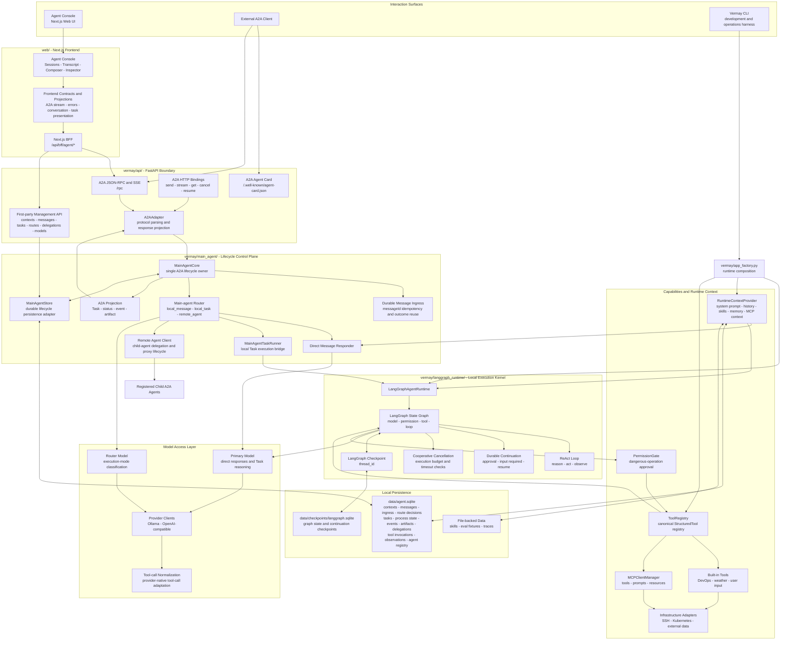

# Current System Architecture

## Purpose

This document describes the architecture implemented by the current Vermay
codebase. It is the reference for concrete package boundaries, request flow,
state ownership, and persistence.

It does not define the longer-term Agent OS direction. Strategic evolution and
future capability boundaries are documented separately in
[agent-os-evolution.md](agent-os-evolution.md).

## Architecture Diagram



## Layer Responsibilities

### Interaction and Web Layer

The Web UI is a first-party operational surface rather than a lifecycle owner.
Its BFF calls the A2A boundary for agent execution and the management API for
read models and diagnostics. Frontend projections turn protocol records into a
session transcript and Inspector views without defining backend state.

The CLI is intentionally different: it builds and calls the LangGraph runtime
directly as a development and operations harness. It does not model the full
A2A lifecycle owned by `MainAgentCore`.

### API Boundary

`vermay/api/` exposes the public A2A protocol and first-party management routes.
The API layer parses transport requests, maps structured errors, and projects
responses. It does not decide routing, Task lifecycle, or graph topology.

`POST /rpc` is the canonical A2A JSON-RPC endpoint. SSE and the A2A HTTP
bindings expose the same underlying `MainAgentCore` lifecycle.

### Main-agent Lifecycle Control Plane

`MainAgentCore` is the single owner of externally meaningful lifecycle facts:

- durable Message ingress and `messageId` idempotency;
- route selection and persisted route decisions;
- A2A Task creation, cancellation, continuation, and terminal state;
- local process transitions and Task event publication;
- artifact and assistant Message persistence;
- child-agent delegation and remote Task proxying.

The router selects one of three execution paths:

| Route | Meaning |
| --- | --- |
| `local_message` | Produce a direct model-backed answer without creating an A2A Task. |
| `local_task` | Create a durable A2A Task and execute it through LangGraph. |
| `remote_agent` | Delegate work to a registered child A2A agent and proxy its lifecycle. |

### Local Execution Kernel

`vermay/langgraph_runtime/` owns local graph execution only. It manages model
and tool loops, permission checks, approval or user-input interrupts,
cooperative cancellation, and checkpoint continuation.

It does not own the public A2A Task identity or protocol status. Runtime results
are returned to `MainAgentCore`, which persists and projects them into A2A
Messages, Task status updates, events, and artifacts.

### Capability and Context Layer

`RuntimeContextProvider` assembles bounded execution context from the system
prompt, causal conversation history, authored skills, explicit memory, and
selected MCP prompts or resources.

`ToolRegistry` is the canonical source of executable `StructuredTool` objects.
The same tool definitions provide model-facing schemas and LangGraph `ToolNode`
execution. `PermissionGate` intercepts dangerous operations before execution.

### Persistence Layer

Vermay separates product lifecycle storage from graph continuation storage:

| Store | Responsibility |
| --- | --- |
| `data/agent.sqlite` | Contexts, Messages, ingress outcomes, route decisions, A2A Tasks, local process state, events, artifacts, delegations, tool invocations, observations, and registered agents. |
| `data/checkpoints/langgraph.sqlite` | LangGraph graph state and continuation checkpoints addressed by `thread_id`. |
| File-backed data | Authored skills, evaluation fixtures, generated traces, and other larger local artifacts. |

## Identity and State Ownership

The system deliberately keeps protocol identity, conversation identity, and
runtime continuation identity separate.

| Identity | Owner | Meaning |
| --- | --- | --- |
| `context_id` / `session_id` | Main-agent lifecycle | Long-lived conversation or work context containing multiple Messages and Tasks. |
| `message_id` | A2A / main-agent ingress | One user or agent Message; repeated top-level IDs reuse the durable ingress outcome. |
| `task_id` | A2A | Public identity of one durable unit of work and its lifecycle. |
| local process state | Main-agent lifecycle | Internal execution bookkeeping used to govern queued, running, interrupted, canceled, failed, and completed work. |
| `thread_id` | LangGraph runtime | Checkpoint key for one local graph execution and its continuation. It is not a public Task or session identity. |

A2A Task state is the public protocol projection. Local process state is the
durable internal lifecycle. LangGraph state is execution-engine state. These
states are related, but they are not interchangeable.

## Primary Request Flows

### Direct Message

```text
A2A Message
  -> A2AAdapter
  -> MainAgentCore durable ingress
  -> router selects local_message
  -> Direct Message Responder
  -> primary model
  -> persist assistant Message and ingress outcome
  -> return or stream A2A Message
```

### Local Task

```text
A2A Message
  -> MainAgentCore durable ingress
  -> router selects local_task
  -> create A2A Task and local process records
  -> MainAgentTaskRunner
  -> LangGraphAgentRuntime using thread_id
  -> model / permission / tool / observation loop
  -> final result, interrupt, cancellation, or failure
  -> MainAgentCore persists events, artifacts, and terminal state
  -> project A2A Task updates
```

### Child-agent Delegation

```text
A2A Message
  -> router selects remote_agent
  -> resolve registered child agent
  -> submit remote A2A request
  -> persist delegation and proxy state
  -> validate remote snapshots and events
  -> project the delegated result through the main-agent boundary
```

## Architectural Summary

The current implementation can be summarized as follows:

> A2A is the service protocol, `MainAgentCore` is the lifecycle control plane,
> LangGraph is the local Task execution kernel, SQLite is the single-host
> durability foundation, and the Web UI is an operational projection and
> inspection surface.
