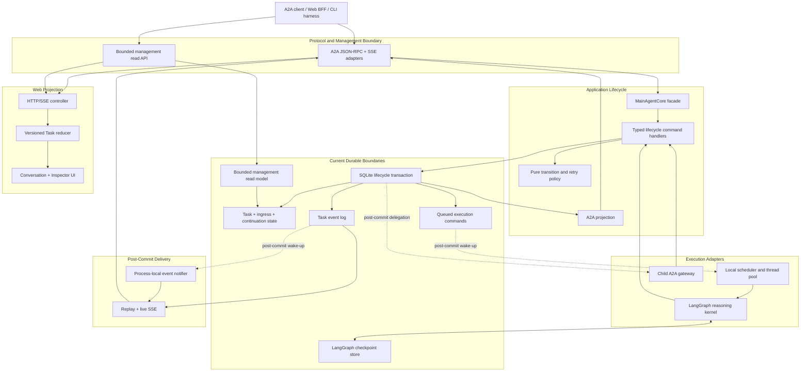

# Single-Host Contract Refactor Plan

> Status: active; M0 through M6 implemented and validated; M7 is not authorized  
> Scope: contract normalization and bounded refactoring of the current single-host system  
> Last reviewed: 2026-08-16

## 1. Purpose

Vermay now has one user-visible lifecycle spanning A2A requests, durable Message
ingress, Task state, LangGraph continuation, execution scheduling, SSE replay,
management reads, and the Web projection. Recent defects exposed missing or
implicit contracts for ordering, transaction completion, execution handoff,
and frontend state ownership.

This plan makes those contracts explicit and permits moderate refactoring where
the current code has demonstrated coupling or duplicate state handling. It is
not a distributed-systems implementation plan and does not pre-design the
internal APIs of PostgreSQL, Redis, Temporal, or any other possible future
middleware.

The current product boundary remains a single-host application using SQLite,
the local execution queue and thread pool, process-local notification,
LangGraph, and the existing Next.js Web console.

## 2. Decisions Fixed For This Plan

The following decisions are not reopened by implementation milestones:

1. A2A remains the public agent protocol boundary.
2. The application lifecycle layer remains the only owner of Message admission,
   route outcomes, public Task identity, continuation acceptance, and terminal
   Task state.
3. LangGraph remains the local reasoning and checkpoint continuation engine. It
   does not own public A2A lifecycle state.
4. SQLite remains the only product lifecycle store during this plan.
5. The existing durable queued-execution record and local worker remain the
   execution mechanism during this plan.
6. Persisted Task events remain the replay authority; a live SSE connection and
   process-local condition remain delivery mechanisms only.
7. The Web console remains a projection and control surface, not a lifecycle
   state owner.
8. No interface is added solely because a future middleware product might need
   it.

## 3. Current Pressure And Refactor Boundary

The architecture direction remains sound, but responsibility is concentrated:

| Area | Demonstrated pressure | Allowed response |
| --- | --- | --- |
| `MainAgentCore` | Lifecycle commands, execution handoff, continuation, recovery, remote delegation, and result persistence meet in one class. | Extract typed command handlers one workflow at a time while retaining one lifecycle authority. |
| `MainAgentStore` | Atomic lifecycle workflows, queue records, events, reads, and subscription notification share one adapter. | Make transaction ownership and post-commit effects explicit; split internal ownership only when a migrated workflow benefits. |
| LangGraph runtime | Reasoning, limits, permission interruption, continuation, and provider normalization are concentrated. | Preserve it as one bounded execution kernel; do not introduce another orchestrator in this plan. |
| Web console | Transport, hydration, Task merging, session reads, controls, and presentation state meet in one component. | Introduce one Task projection reducer and extract only transport/read controllers with demonstrated state ownership. |

This plan does not use file size as a success criterion. A file is split only
when the new boundary has an explicit contract, an independent reason to
change, and focused tests.

## 4. Required Contracts

### 4.1 Lifecycle Command Contract

Externally meaningful intent enters through a small application command
surface. The expected commands are:

- admit one A2A Message;
- cancel one Task;
- approve or reject one approval continuation;
- submit one ordinary input continuation;
- retry one safely retryable Task;
- reconcile startup state; and
- record one local or remote execution outcome.

`MainAgentCore` remains the facade and composition point while these commands
are extracted vertically. A command handler may validate policy and perform one
lifecycle transaction. It may not expose raw SQL records to protocol adapters,
schedule work before commit, or let an execution adapter mutate Task state.

Remote delegation remains a route outcome handled through the child A2A
gateway. Message ingress and the remote route decision must commit before the
outbound child-agent call starts. The remote result, delegation record, and any
local proxy Task are persisted after the child responds. This plan records the
resulting crash uncertainty and forbids blind automatic replay; it does not
claim exactly-once remote delivery or force delegation into the local queue's
claim semantics.

### 4.2 Lifecycle Transaction Contract

One accepted command follows this order:

```text
command
  -> validate transition and idempotency
  -> persist state + events + optional queued execution command
  -> commit
  -> perform explicit post-commit execution or delivery actions
```

The transaction boundary must preserve these meanings:

- the Task row is the authority for current Task and local-process state;
- the Task event log is the authority for audit and SSE replay history;
- the queued-execution record is durable intent to run the next local slice;
- LangGraph checkpoints are a separate continuation store;
- notification is disposable and occurs only after commit.

This is not Event Sourcing. Current Task state is not reconstructed from the
event log, and the plan does not add a generic outbox or event-bus framework.

Post-commit actions are limited to waking committed local work, starting an
accepted remote delegation, and notifying subscribers. They do not mutate
authoritative Task state directly.

The implementation may introduce a small lifecycle unit-of-work or transaction
result type if it makes commit and post-commit actions explicit. It must not
introduce generic CRUD repositories or a database abstraction that mirrors a
future vendor SDK.

### 4.3 Ordering Contract

Task snapshot freshness and event delivery order are separate concepts:

- `lifecycle_revision` is a monotonically increasing version of the public Task
  projection;
- `event_id` is the durable event cursor used for replay and subscription;
- Context and Session read models do not reuse a Task revision as their own
  version.

Every mutation that changes the public Task projection increments
`lifecycle_revision` in the same transaction. Persisted events produced by that
mutation carry the resulting revision. Multiple additive events may share a
revision, but `event_id` still defines their replay order.

The frontend Task reducer must define deterministic behavior for:

- a newer revision;
- an older revision;
- a duplicate event;
- an equal revision with additive artifact or event information; and
- legacy or malformed input with a missing revision.

Task-derived Session presentation should be derived from the accepted Task
projection instead of being updated by an independent arrival-order path.
Context title and other Context-only fields remain part of the bounded Context
read model; no Context revision is introduced without a reproduced ordering
defect.

### 4.4 Local Execution Contract

The current local execution design remains:

```text
committed queued-execution record
  -> post-commit worker wake-up
  -> atomic claim
  -> bounded LangGraph execution slice
  -> typed execution outcome
  -> lifecycle command records the outcome
```

The application-facing scheduling boundary is intentionally small. It may wake
or submit a committed local execution, request cooperative cancellation, and
perform startup recovery. Queue claim, thread-pool ownership, and worker
internals stay inside the local adapter.

This plan does not add durable leases, heartbeats, multi-worker ownership, or a
generic workflow-engine contract. Those concepts require a separate measured
need and architecture decision.

### 4.5 External-Effect Safety Contract

No automatic retry, recovery, or cancellation path may replay a started
non-read-only tool invocation when its external outcome cannot be proven.

The Tool Invocation Ledger remains the authority for prepared, running,
succeeded, canceled, and uncertain effect attempts. A worker crash or transport
failure after an external write begins must preserve `uncertain` rather than
convert it into permission to execute again.

### 4.6 Event And Subscription Contract

Persisted events are queried by `event_id`. The process-local notifier only
wakes a subscriber after commit. A subscriber always re-reads durable events
after waking and therefore tolerates lost or duplicate notification.

SSE replay, live delivery, and reconnect use the same cursor semantics.
Malformed or unprojectable durable events produce an explicit protocol or
projection failure; they are not silently dropped and presented as a hung page.

### 4.7 Read Model And Web State Contract

Management reads remain bounded and SQLite-backed. Existing `limit/offset`
behavior is sufficient until measurements justify a cursor migration. The plan
does not require cursor pagination across every endpoint.

The Web console may be moderately split into:

- HTTP/SSE transport and subscription lifecycle;
- Session and bounded read-model loading;
- one version-aware Task projection reducer; and
- stateless or locally visual components.

No component or request callback may independently reconcile durable Task
state outside the reducer.

## 5. Target Logical Architecture



This is a logical ownership map. It does not require one class or package for
every box.

## 6. Executable Invariants

The refactor is not complete until tests enforce all of the following:

1. A repeated `messageId` cannot route, create a Task, call a child agent, or
   execute a tool twice.
2. One accepted command produces one atomic lifecycle mutation sequence.
3. A Task mutation, its revision, and its public events commit together.
4. A worker cannot observe or claim a queued execution before the accepting
   transaction commits.
5. HTTP snapshots, SSE replay, live SSE, and hydration obey one revision and
   event-cursor rule.
6. An older or duplicate Task projection cannot regress status, metadata,
   errors, artifacts, or displayed completion.
7. Approval and ordinary input continuations cannot use the wrong acceptance
   path or change the original Task input cut.
8. Notification loss or duplication cannot lose durable Task facts.
9. A worker crash cannot create a second public Task for the same accepted
   command.
10. A started non-read-only tool invocation with an uncertain result cannot be
    automatically replayed.
11. A2A state, local process state, and LangGraph checkpoint state remain
    distinct.
12. Human suspension time is not silently treated as active model or tool
    execution time.

## 7. Phased Implementation

### M0: Baseline And Contract Freeze

**Goal:** create an executable baseline and remove ambiguity before moving
ownership.

**Work:**

1. Create one named regression matrix covering direct Message, streamed
   Message, local Task, approval, ordinary input, cancellation, safe retry,
   restart recovery, SSE reconnect, duplicate `messageId`, stale snapshots,
   malformed events, uncertain write effects, and deterministic child-agent
   delegation.
2. Inventory every Task-state mutation, direct SQL lifecycle workflow, queue
   submission point, event append, notifier call, and frontend Task-state write.
3. Record concise decisions for lifecycle authority, revision versus event
   cursor, post-commit effects, and external-effect replay safety.
4. Freeze only new features that change lifecycle semantics until M1 and M2
   close. Bug fixes, tests, documentation, and build maintenance remain allowed.

**Exit criteria:** the regression matrix names its exact tests and gates; every
lifecycle write and projection source has one recorded owner.

### M1: Task Revision And Frontend Projection

**Goal:** remove arrival-order state management before structural extraction.

**Work:**

1. Add durable `lifecycle_revision` to the Task projection and increment it for
   every public Task mutation.
2. Attach the revision to A2A Task metadata, Task status events, management Task
   records, continuation responses, and recovery snapshots.
3. Keep `event_id` as the separate replay cursor.
4. Route HTTP, SSE, replay, hydration, cancellation, retry, and continuation
   updates through one frontend reducer.
5. Remove independent Session status updates that can race the accepted Task
   projection.
6. Define a deliberate clean-development reset or forward migration for the
   schema change. Do not add legacy compatibility branches.

**Exit criteria:** deliberately reordered and duplicated snapshots/events do
not regress the transcript, Session presentation, Inspector, artifacts, errors,
or terminal state.

**Implementation status (2026-08-16): complete.**

- SQLite schema version 4 adds `lifecycle_revision` to durable Task and Task
  event records. New Tasks start at revision 1. A real public Task mutation
  increments the revision in the same transaction; an idempotent no-op does
  not. Events inherit the Task revision current at insertion, while `event_id`
  remains their replay cursor.
- A2A Task snapshots, status and artifact events, management Task records,
  continuation responses, retry responses, and recovery reads project the
  revision. The schema uses a forward migration and adds no compatibility
  branch or alternate persistence path.
- `web/lib/agent/task-projection-reducer.ts` is the only reducer for durable
  Task sources. HTTP hydration, SSE, replay, cancel, continuation, retry, and
  stream reconciliation all enter it; Session lifecycle presentation is
  derived from its accepted Task projection.
- The reducer accepts newer revisions, rejects older revisions, permits only
  additive evidence at an equal revision, and falls back to timestamps only
  when revision metadata is missing. Equal-revision data cannot reintroduce an
  obsolete status, continuation request, or error.
- Focused and full-stack gates cover revision persistence, A2A projection,
  duplicate and reordered input, equal-revision merging, and the existing
  transcript and Inspector behavior. Detailed evidence is recorded in the
  [M1 Task Projection Handoff](m1-task-projection.md).

### M2: Lifecycle Command Surface

**Goal:** reduce `MainAgentCore` without creating a second lifecycle owner.

**Work:**

1. Introduce typed command inputs and outcomes for the command set in section
   4.1.
2. Extract one vertical workflow at a time while retaining `MainAgentCore` as
   the facade and composition point.
3. Keep local Task transition policy pure and separate from remote proxy
   synchronization policy.
4. Replace raw tuples and store records at the protocol boundary with typed
   outcomes.
5. Delete each replaced private implementation path after its focused and
   regression tests pass.

**Exit criteria:** every protocol mutation enters one application command
surface and every command has one implementation path.

**Implementation status (2026-08-16): complete.**

- `vermay/main_agent/commands.py` defines immutable command inputs and typed
  outcomes for Message admission, cancellation, approval and ordinary-input
  continuation, safe retry, startup reconciliation, and accepted local or
  remote Task outcomes.
- `MainAgentCore.execute()` is the single non-streaming lifecycle command
  entry. `MainAgentCore.stream()` accepts the same typed Message-admission
  intent for streaming. Named in-process facade methods delegate immediately
  to those entry points and do not retain a parallel implementation path.
- `TaskOutcomeRecorder` is owned by `MainAgentCore` and records only accepted
  local or remote execution outcomes. It cannot route, schedule, invoke a
  model, or become another lifecycle owner.
- The A2A adapter constructs typed commands and consumes typed outcomes instead
  of treating raw persistence records as mutation results. FastAPI startup
  reconciliation and the management retry endpoint use the same command
  surface.
- Focused command and A2A boundary coverage passed 137 tests. The focused
  single-host gate passed 217 backend tests and 18 Playwright tests. The full
  gate passed 489 Python tests, frontend type checking, the Next.js production
  build, and the same 18 Playwright tests. Detailed limits and handoff evidence
  are recorded in the
  [M2 Lifecycle Command Surface Handoff](m2-lifecycle-command-surface.md).

### M3: Transaction And Post-Commit Boundary

**Goal:** make existing SQLite atomicity and side-effect ordering explicit.

**Work:**

1. Define lifecycle transaction workflows around accepted commands rather than
   generic CRUD repositories.
2. Make queued execution and Task event writes part of the relevant lifecycle
   transaction.
3. Collect worker wake-up, accepted remote delegation, and event notification
   as post-commit actions.
4. Separate current-state reads, event replay, queue commands, and bounded
   management reads inside `MainAgentStore` only where the migrated workflows
   require it.
5. Keep one SQLite transaction owner and one production storage adapter.
6. Add transaction rollback, commit-before-wake, and duplicate-notification
   tests.

**Exit criteria:** no worker or subscriber is notified before commit; command
handlers depend on explicit lifecycle transaction behavior rather than
incidental sequences of store calls.

**Implementation status (2026-08-16): complete.**

- `LifecycleTransactionRunner` gives accepted lifecycle workflows one explicit
  order: mutate durable state inside the existing SQLite transaction, commit,
  then execute a named process-local action. It is a narrow application
  contract, not a generic repository, event bus, outbox, or vendor-shaped unit
  of work.
- Local Task admission commits the Task, ingress resolution, initial events,
  and queued-execution intent before waking the local worker. Approval and
  ordinary-input continuation commit their continuation state before waking
  the same Task. Safe retry commits its child attempt before starting it.
- Cancellation commits the lifecycle transition before signaling cooperative
  runtime cancellation. Remote routing commits Message ingress and the route
  decision before the child-agent call begins; the existing remote-call crash
  ambiguity remains explicit and no exactly-once claim is made.
- Durable Task-event insertion continues to register subscriber wake-up through
  `AgentStore.register_after_commit()`. Nested transaction scopes join the
  outer SQLite transaction, so rollback discards their callbacks and duplicate
  wake-ups do not create duplicate durable events.
- The implementation retains one `AgentStore` transaction owner and one
  `MainAgentStore` production adapter. It does not split current-state reads,
  replay, or management reads solely to reduce file size.
- Rollback, commit-before-wake, commit-before-remote-call, continuation,
  cancellation, and duplicate-notification behavior is enforced by focused
  tests and the single-host reliability gate. Detailed semantics and evidence
  are recorded in the
  [M3 Transaction And Post-Commit Boundary Handoff](m3-transaction-post-commit-boundary.md).

### M4: Bounded Local Execution Boundary

**Goal:** separate committed lifecycle intent from the current local scheduling
mechanism.

**Work:**

1. Introduce the minimal local execution boundary described in section 4.4.
2. Keep the durable SQLite execution record and current thread pool.
3. Make queued command payloads typed, versioned, and immutable.
4. Return typed execution outcomes to the lifecycle command surface.
5. Keep checkpoint continuation separate from public approval/input commands.
6. Preserve cooperative cancellation and Tool Invocation Ledger safety.
7. Make startup reconciliation consume durable Task, queue, checkpoint, and
   invocation facts without introducing leases.

**Exit criteria:** local scheduling code no longer decides lifecycle state, and
replacing or testing the local scheduler does not require changes to A2A
adapters or LangGraph nodes.

**Implementation status (2026-08-16): complete.**

- SQLite schema version 5 adds `command_version` to queued local execution.
  Initial, approval, and ordinary-input commands use immutable kind-specific
  payloads with strict serialization and durable-read validation.
- `InProcessLocalExecutionAdapter` owns only process-local wake-up,
  scheduled/active deduplication, runner dispatch, cooperative cancellation
  forwarding, and checkpoint cleanup. It cannot mutate Task lifecycle state,
  Messages, events, or artifacts.
- `MainAgentCore` atomically claims queued commands, captures the immutable
  initial causal input cut, and records `LocalExecutionSucceeded` or
  `LocalExecutionFailed` outcomes through its existing lifecycle command
  boundary.
- Initial Task execution, approval continuation, and ordinary input
  continuation now use one durable queue/claim/dispatch/outcome path in both
  synchronous test composition and the production thread pool. The replaced
  direct runner paths were removed.
- Startup recovery accepts only validated, unclaimed queued commands and keeps
  claimed work conservative. The Tool Invocation Ledger continues to block
  replay of uncertain non-read-only effects.
- Focused, single-host, full-stack, and configured real-model smoke evidence is
  recorded in the
  [M4 Bounded Local Execution Handoff](m4-bounded-local-execution.md).

### M5: Event Replay And Subscription Boundary

**Goal:** make durable replay and disposable notification visibly separate.

**Work:**

1. Keep the Task event table as the replay authority.
2. Move notifier wake-up to an explicit post-commit boundary.
3. Use `event_id` consistently for initial replay, live continuation, and
   reconnect.
4. Make malformed and unprojectable event failures visible to the subscriber
   and Web UI.
5. Add notification loss, duplicate delivery, reconnect, and subscriber cleanup
   tests.

**Exit criteria:** connection loss, notification loss, and duplicate wake-up do
not lose or reorder durable history, and protocol errors do not appear as an
indefinite loading state.

**Implementation status (2026-08-16): complete.**

- `InProcessTaskEventNotifier` is a narrow injectable wake-up port. The Task
  event table remains the replay authority, and `MainAgentStore` notifies only
  through an after-commit callback.
- Subscribers durably read before and after waiting, so notification loss adds
  bounded latency but cannot lose history. Duplicate or spurious wake-ups do
  not create or replay duplicate durable rows.
- Initial replay, live continuation, and reconnect share one `event_id` cursor.
  A cursor advances only after the selected durable batch projects completely.
- Unprojectable durable events raise a structured projection error. The A2A
  SSE route emits an explicit JSON-RPC error event, and the Web console closes
  and reconciles the subscription instead of silently hanging.
- Focused tests passed 82 tests. The single-host gate passed 228 backend and 19
  Playwright tests; the full-stack gate passed 500 Python tests, frontend type
  checking, the Next.js production build, and the same 19 Playwright tests.
  Detailed semantics and limits are recorded in the
  [M5 Event Replay And Subscription Handoff](m5-event-replay-subscription.md).

### M6: Bounded Reads And Moderate Web Split

**Goal:** reduce read and frontend orchestration pressure without building a new
query framework or component architecture.

**Work:**

1. Preserve bounded Context reads and add bounds to other endpoints only where
   payload or latency evidence justifies it.
2. Keep management reads outside lifecycle mutation handlers even when both use
   the same SQLite adapter.
3. Extract one Session/read controller and one Task stream controller from
   `agent-console.tsx` if M1-M5 leave demonstrated independent responsibilities.
4. Keep one Task reducer as the only durable lifecycle state writer.
5. Leave visual components local unless extraction removes real duplication or
   state ownership.

**Exit criteria:** the console has one Task projection path, bounded default
reads, stable selection, and no new generic frontend state framework.

**Implementation status (2026-08-16): complete.** The four Context detail read
models default to the latest 200 records and cap requests at 500. The browser
uses one Session read controller and one Task event controller; durable Task
inputs still enter the revision-aware reducer. The implementation deliberately
does not add history-loading UI, cursor pagination, or a generic data-fetching
framework. Detailed evidence and activation limits are recorded in the
[M6 Bounded Reads And Web Controllers Handoff](m6-bounded-reads-web-controllers.md).

### M7: Cleanup And Baseline Closure

**Goal:** finish the refactor without leaving parallel paths or speculative
abstractions.

**Work:**

1. Delete replaced private methods, compatibility aliases, unused SQL helpers,
   duplicate frontend merge logic, and stale tests.
2. Rename files or methods only where ownership became clearer during the
   preceding milestones.
3. Re-run static dependency and dead-code scans, then inspect every proposed
   deletion before applying it.
4. Update stable architecture documentation only for behavior now confirmed by
   code and tests.
5. Record remaining concentration as accepted debt with an activation signal.

**Exit criteria:** there is one lifecycle path per command, one Task projection
path in the Web console, passing normal regression gates, and no retained
adapter or interface justified only by hypothetical middleware.

## 8. Validation Strategy

Validation scales with the milestone instead of requiring every layer for every
documentation or internal edit.

| Milestone | Required validation |
| --- | --- |
| M0 | Deterministic contract matrix and current regression gates. |
| M1 | Backend revision tests, frontend reducer tests, stale/reordered browser scenarios, and full-stack regression. |
| M2 | Focused command tests, public A2A boundary tests, and full-stack regression for migrated commands. |
| M3 | Transaction rollback and post-commit ordering tests plus single-host regression. |
| M4 | Slow model, failure, cancellation, approval/input, restart recovery, uncertain tool effect, and at least one configured real workflow. |
| M5 | Replay, reconnect, malformed event, notifier loss/duplication, and browser subscription cleanup. |
| M6 | Bounded read tests, frontend type/build checks, and Playwright conversation/Inspector regression. |
| M7 | Complete backend, frontend, full-stack, documentation, and clean-worktree gates. |

Tracked files must remain unchanged after normal validation. A milestone that
changes persistence, execution, subscription, or frontend reconciliation cannot
close from unit tests alone.

## 9. Refactor And Deletion Rules

1. Migrate vertically, one observable workflow at a time.
2. Do not keep old and new lifecycle paths active beyond the migration of one
   command.
3. Do not add generic repositories, event buses, schedulers, or infrastructure
   service locators.
4. Do not introduce dual writes or a second lifecycle source of truth.
5. Preserve public A2A compatibility unless a separate protocol decision
   explicitly changes it.
6. Keep lifecycle storage and LangGraph checkpoint storage as independent
   boundaries.
7. Use a clean development reset instead of preserving obsolete local schema
   compatibility when the milestone explicitly authorizes it.
8. Inspect and test every deletion; tree shaking is not a bulk file-removal
   exercise.
9. File-size reduction is useful only when ownership and change coupling also
   improve.

## 10. Future Infrastructure Compatibility

PostgreSQL, Redis, Temporal, or another middleware may become appropriate in a
later product phase. Their current status is **unselected and unauthorized**.

This plan preserves only these durable constraints:

- a future lifecycle store must preserve the command transaction and revision
  invariants;
- a future notifier must remain disposable and recoverable from persisted event
  cursors;
- a future execution system must not own A2A identity or application transition
  policy; and
- a future checkpoint store must remain distinct from public Task identity.

No current milestone adds their dependencies, vendor-shaped interfaces,
leases, distributed locks, cache invalidation, workflow definitions, dual-write
migrations, or operational deployment model. Any adoption requires a new ADR
based on measured workload, failure, and operating requirements at that time.

## 11. Explicit Non-Goals

This plan does not add:

- distributed deployment or multi-instance coordination;
- PostgreSQL, Redis, Temporal, or another middleware dependency;
- durable execution leases or heartbeats;
- a generic event-sourcing or CQRS framework;
- microservices;
- a plugin architecture for internal repositories;
- cursor pagination without measured need;
- final-answer Task token streaming;
- new agent capabilities or user-facing workflows; or
- compatibility with obsolete local schemas or internal APIs.

## 12. Recommended Order

```text
M0 baseline and contract freeze
  -> M1 lifecycle revision and frontend reducer
  -> M2 lifecycle command surface
  -> M3 transaction and post-commit boundary
  -> M4 bounded local execution boundary
  -> M5 event replay and subscription boundary
  -> M6 bounded reads and moderate Web split
  -> M7 cleanup and baseline closure
```

M1 fixed the current ordering ambiguity before structural extraction. M2 preserves
one lifecycle owner before transaction and scheduling details move. M3 makes
commit ordering explicit before M4 and M5 extract execution or notification.
M6 follows the lifecycle work so frontend splitting does not preserve obsolete
state paths.

## 13. Authority And First Decision

This document is planning authority for cross-cutting contract work. The
Runtime roadmap continues to own current product behavior.

M0 was implemented under these constraints:

1. the development index must identify this plan as the active refactor
   authority;
2. overlapping Runtime S4/S5 work must be mapped here instead of remaining a
   second active plan;
3. the SQLite single-host behavior remains the preservation baseline;
4. only lifecycle-changing feature development is temporarily frozen; and
5. no future middleware work is authorized.

**M0: Baseline And Contract Freeze**, **M1: Task Revision And Frontend
Projection**, **M2: Lifecycle Command Surface**, **M3: Transaction And
Post-Commit Boundary**, **M4: Bounded Local Execution Boundary**, **M5: Event
Replay And Subscription Boundary**, and **M6: Bounded Reads And Moderate Web
Split** are implemented and validated. Their inventories, bounded limitations,
and executable evidence are maintained in these handoffs:

- [M0 Contract Baseline](m0-contract-baseline.md)
- [M1 Task Projection Handoff](m1-task-projection.md)
- [M2 Lifecycle Command Surface Handoff](m2-lifecycle-command-surface.md)
- [M3 Transaction And Post-Commit Boundary Handoff](m3-transaction-post-commit-boundary.md)
- [M4 Bounded Local Execution Handoff](m4-bounded-local-execution.md)
- [M5 Event Replay And Subscription Handoff](m5-event-replay-subscription.md)
- [M6 Bounded Reads And Web Controllers Handoff](m6-bounded-reads-web-controllers.md)

M7 remains unauthorized until explicitly selected.
