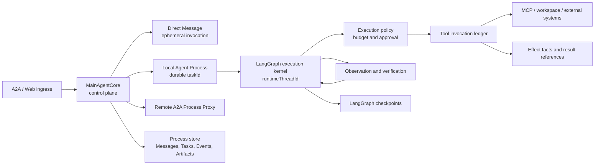

# Runtime Evolution Path

## Status And Authority

This document connects the long-term Agent OS architecture to an implementable
runtime sequence. It explains why each stage exists, what must already be true
before that stage begins, and what remains deliberately deferred.

It is not a second active backlog. Use [roadmap.md](roadmap.md) for current
milestone status and priority, [state-ownership.md](state-ownership.md) for
normative runtime behavior, and
[agent-os-architecture.md](../agent-os-architecture.md) for the strategic
vocabulary and target boundary.

## Reassessment Decision

The current architecture should evolve through a stable control plane and a
replaceable execution kernel:

```text
A2A / Web ingress
  -> MainAgentCore control plane
     -> direct Message invocation
     -> durable local Agent Process
        -> LangGraph execution kernel
           -> governed capability execution
     -> remote A2A Process Proxy
```

The phrase "reliable outer graph plus dynamic inner agent" does not require two
LangGraph graphs. In Vermay Agent:

- `MainAgentCore` already implements the deterministic outer lifecycle through
  application code, transactions, durable commands, and recovery policy;
- LangGraph remains the local process execution kernel and checkpoint engine;
- A2A remains the public Message, Task, continuation, cancellation, artifact,
  and federation contract;
- tools, workspaces, and child agents remain capabilities reached through
  explicit policy and trust boundaries.

Moving A2A ingress, public Task state, durable queue ownership, or Context
deletion into another LangGraph graph would create a second lifecycle state
machine. The evolution path therefore strengthens the current ownership model
instead of replacing it with a larger graph.

## Feasibility Assessment

| Stage | Feasibility | Current evidence | Decision |
| --- | --- | --- | --- |
| R0, runtime integrity closure | Complete, 2026-08-02 | Durable ingress, local transitions, queued commands, startup reconciliation, and continuation records now have one enforced integrity boundary. | Use as the baseline for R1. |
| R1, side-effect execution boundary | Complete, 2026-08-02 | Local non-read-only ToolNode calls now receive a durable identity, exact approval binding, conservative replay prevention, and result artifact reference. | Use as the safety baseline for R2. |
| R2, governed execution kernel | Complete, 2026-08-02 | Local Tasks now have immutable execution limits, typed stop reasons, normalized observations, and deterministic evidence/risk summaries. | Keep planning and scheduling deferred. |
| R3, workspace and isolation boundary | R3.1 complete; broader work conditional | The concrete SSH/Kubernetes path now has bounded local-process control, but capabilities still do not share a filesystem workspace or general isolation contract. | Keep the R3.1 adapter narrow; add a workspace or sandbox only for a demonstrated workload. |
| R4, persistent planning and replanning | Medium, evidence-dependent | The model can choose actions, but no current workload proves that a durable task DAG improves outcomes. | Pilot only after R1-R3 make actions safe and verifiable. |
| R5, distributed scheduling and federation | Conditional | The current runtime is intentionally single-host and has no worker lease or cross-node ownership requirement. | Defer until deployment evidence justifies it. |

The project is technically capable of reaching R4 and R5, but implementing
those stages now would increase state and recovery complexity before the
execution boundary is reliable enough to support them.

## Current Stage Constraint

R3.1 completes the only currently demonstrated host-reaching control gap.
There is no active R3.2, R4, or R5 implementation milestone. Current work
should stabilize and observe the R0-R3.1 single-host baseline through real
direct Message, local Task, continuation, cancellation, and capability
workflows.

Treat the stage sections below as activation criteria, not a default feature
backlog. Before activating one of them, record the concrete workload, the
missing boundary in the current runtime, and the smallest extension that
addresses it. Do not introduce a generic workspace, sandbox, planner,
scheduler, or distributed service because the architecture could eventually
use one.

## Target Runtime Boundary



These stores represent different facts and must not be collapsed into one
overloaded state model:

| State boundary | Authority | Must not own |
| --- | --- | --- |
| Main-agent store | Message ingress, Context order, process lifecycle, continuation, delegation, events, and artifacts | LangGraph node position or raw external-system state |
| LangGraph checkpoint | Local execution continuation for one `runtimeThreadId` | Public `taskId`, queue ownership, or A2A TaskState |
| Tool invocation ledger | Attempt identity, normalized request, approval binding, side-effect outcome, and result references | Overall Agent Process completion |
| Workspace or external system | Actual files, commands, Kubernetes resources, remote services, and other world state | A2A lifecycle or application event history |

## R0: Close Current Runtime Integrity Gaps

R0 is the prerequisite for all broader Agent execution work. It adds no new
agent capability.

**Status: Complete, 2026-08-02.** The implementation closes the current
single-host lifecycle gaps without adding a scheduler, broker, or second state
machine.

### R0.1 Core-owned Context deletion

- `MainAgentCore.delete_context()` owns destructive Context management.
- A Context with any nonterminal local or remote Task returns a structured
  conflict. The current `force` parameter deliberately does not weaken that
  rule; it reserves an explicit future cancel-and-wait operation rather than
  erasing records while execution may continue.
- A terminal local Task's LangGraph checkpoint is discarded before its
  application records are removed, when the configured runner supports
  checkpoint deletion.
- `MainAgentCore.delete_registered_agent()` hard-deletes only registrations
  with no delegation history. An agent with active work or retained delegation
  facts must stay registered; callers disable it through the registration
  update API instead.

### R0.2 Atomic initial Task acceptance

For the asynchronous product path, `accept_local_task_from_message()` commits
the following facts in one SQLite transaction:

```text
Task record
  + immutable input cut
  + resolved Message ingress
  + queued process transition
  + initial durable execution command
```

The in-process executor is scheduled only after that commit returns. No
accepted asynchronous Task can become visible in `created` without its
recoverable execution command. Startup reconciliation still fails impossible
stranded states explicitly rather than leaving them active.

### R0.3 Direct-Message stale-ingress policy

- A direct-message stream abandoned before final persistence becomes the
  retryable `message_stream_aborted` ingress failure.
- Startup reconciliation converts every residual `in_progress` direct-message
  ingress from a prior process into retryable `message_ingress_stale` failure.
- The original `messageId` stays non-replayable; it replays the persisted
  failure. A caller must send a new `messageId` to explicitly retry.
- This does not turn direct-message recovery into an A2A Task or scheduler
  feature.

### R0.4 Remove impossible compatibility paths

- Legacy Message-to-ingress materialization is removed from the product path.
- A stored top-level Message without its required ingress ownership record is
  an integrity error.
- Process-local `messageId` locks are removed. SQLite uniqueness and the
  durable ingress record are the only idempotency authority.

### R0.5 Harden the single-host SQLite boundary

- Every Agent store and LangGraph checkpoint connection enables foreign-key
  checking, a five-second busy timeout, and WAL journal mode.
- Skill listing is read-only; authored skill metadata is synchronized only by
  explicit approval/refresh paths.
- Focused tests cover the SQLite connection contract, cross-connection ingress
  ownership, atomic task acceptance rollback, restart reconciliation, and
  destructive-management conflicts. This remains a single-host boundary, not
  a distributed-worker guarantee.

### R0 Exit Criteria

- Complete. Destructive management cannot detach durable records from live
  execution.
- Complete. An accepted asynchronous Task is recoverably queued in the same
  commit or its acceptance rolls back.
- Complete. Stale direct invocations have a documented visible retryable
  outcome.
- Complete. The clean-slate runtime contains no compatibility inference for
  impossible Message/ingress shapes and no process-local message locks.
- Complete for the single-host baseline. Runtime SQLite connections use the
  same foreign-key, busy-timeout, and WAL contract; true multi-host worker
  coordination remains deferred to R5.

## R1: Establish The Side-Effect Execution Boundary

**Status: Complete, 2026-08-02.** The implemented contract is recorded in
[tool-invocation-ledger.md](tool-invocation-ledger.md).

R1 introduced a minimal Tool Invocation Ledger rather than a planner.
Checkpointing graph state does not prove whether an external side effect
happened, so a dynamic agent cannot be safely replayed without a separate
effect record.

A first record should contain only fields required for correctness:

```text
invocationId
taskId
runtimeThreadId
tool name and normalized arguments
capability and side-effect class
idempotency key when supported
approval binding when required
status: prepared | running | succeeded | failed | uncertain | canceled
result and artifact references
timestamps and structured error
```

Invocation status is not Agent Process state and must never be projected as
A2A TaskState. Start with destructive or remote-write tools. Read-only calls
can adopt the same boundary later when replay, timeout, or audit requirements
justify it.

R1 does not promise exactly-once effects. It makes uncertainty explicit so a
restart can reconcile an external resource before deciding whether to retry.

### R1 Exit Criteria

- complete: every local non-read-only tool attempt has one durable identity
  before execution;
- complete: approval is bound to the Task, invocation, tool, and normalized
  arguments;
- complete: a crash or task failure with a running external call produces an
  `uncertain` fact rather than an automatic repeated write;
- complete: recorded tool results are referenced through Task artifacts rather
  than being stored only in model messages.

## R2: Govern The Dynamic Execution Kernel

R2 makes the existing ReAct loop bounded and evidence-driven without adding a
general planning framework.

**Status: Complete, 2026-08-02.** The implementation is documented in
[governed-execution-kernel.md](governed-execution-kernel.md). It keeps
`MainAgentCore` as the A2A lifecycle owner while the LangGraph kernel applies
per-process model/tool/failure/loop limits, records normalized observations,
and returns a typed stop reason plus deterministic evidence and residual risk.

R2 introduced a task-scoped execution policy with:

- maximum model calls, tool calls, elapsed time, failures, and loop steps;
- typed stop reasons such as completed, input required, approval required,
  budget exhausted, repeated failure, policy blocked, canceled, and
  environment failure;
- normalized tool observations with summary, structured data, error category,
  retryability, changed resources, and artifact references;
- a completion claim accompanied by deterministic evidence and residual-risk
  facts.

Any future verifier must consume recorded evidence; it must not merely ask the
same model whether it believes the work is finished. A model-as-judge review is
not part of the current runtime.

### R2 Exit Criteria

- every local process stops for an explicit reason;
- a model cannot extend a loop beyond its assigned budget;
- process completion cites inspectable evidence or declares residual risk;
- tool failures are classified without requiring the model to infer status
  from arbitrary strings.

## R3: Add Workspace And Isolation Only Where Needed

**R3.1 status: implemented, 2026-08-02.** The current SSH/Kubernetes
capability path has a narrow project-owned execution context. It binds a
durable Task cancellation request, the remaining R2 deadline, and an optional
R1 invocation identity to the local `ssh` subprocess. It does not create a
shared filesystem workspace or a general command executor. See
[workspace-and-isolation-boundary.md](workspace-and-isolation-boundary.md).

The next R3 increment should define a workspace only when a capability truly
shares an execution namespace. A future context may expose working directory,
filesystem operations, command execution, cancellation, snapshots, and
artifact collection, with separate implementations for local, SSH,
Kubernetes, or isolated environments.

Do not make all MCP tools pretend to be filesystem workspaces. A workspace is
appropriate only for capabilities that share an execution namespace and
resource limits. Other MCP or child-agent capabilities remain external
services behind the same policy and invocation boundary.

Broader R3 is activated when Vermay Agent executes arbitrary commands,
modifies files, handles untrusted repositories, or requires rollback. Docker,
a remote worker, or a microVM is an implementation choice made after that
workload exists.

## R4: Add Persistent Planning After Execution Is Trustworthy

An explicit plan becomes valuable when real tasks repeatedly require multiple
dependent steps, replanning, evidence tracking, or partial completion. Until
then, a new planner node and plan tables would duplicate information already
present in the model/tool loop.

When activated, the plan should be scoped to one Agent Process and contain:

- goal and completion criteria;
- revision number and assumptions;
- steps with dependencies, status, attempts, and evidence references;
- explicit replan reason and bounded replan count.

LangGraph may operate on the active plan, while immutable plan revisions are
projected to events or artifacts for inspection. A plan step is not an A2A
Task by default. Promote a step to a child Task only when it needs independent
ownership, lifecycle, cancellation, or delegation.

## R5: Scale Scheduling And Federation When Triggered

Distributed scheduling, parallel plan execution, and deeper A2A federation are
the last stage, not prerequisites for a reliable local agent.

Activate this stage only when at least one condition is demonstrated:

- execution must survive loss of the API process without failing claimed work;
- workers must run on multiple hosts or in separate trust zones;
- queued work needs leases, heartbeats, fairness, quotas, or backpressure;
- one process contains independent subtasks whose parallel execution has a
  measured benefit;
- child-agent Tasks require durable continuation forwarding and health
  reconciliation across service restarts.

Temporal, Redis, Redpanda, or another scheduler should be selected from those
requirements. They must not be introduced merely to complete the Agent OS
analogy.

## Explicit Deferrals

| Capability | Current decision | Activation signal |
| --- | --- | --- |
| Task final-answer token streaming | Deferred | Measured task latency makes final-only artifacts unacceptable. |
| Token-accurate Context accounting | Deferred | Character limits fail against real model windows or audit needs require exact prompt capture. |
| Generic workspace, arbitrary command execution, or sandbox | Deferred after R3.1 | A current capability needs a shared namespace, untrusted-code isolation, or rollback that fixed adapters cannot provide. |
| Persistent plan DAG | Deferred to R4 | Repeated complex tasks need dependencies, replanning, and inspectable evidence. |
| Parallel subtask scheduler | Deferred to R5 | Independent work shows measured wall-clock benefit and conflict policy exists. |
| Temporal or distributed queue | Deferred to R5 | Multi-host ownership or survival of claimed work becomes required. |
| General plugin or multi-profile host | Out of current product scope | Vermay intentionally changes from a main-agent runtime into a hosting platform. |

## Recommended Implementation Sequence

1. Stabilize and observe R0-R3.1 in real single-host workflows. Fix
   correctness, reliability, and inspection issues at existing boundaries.
2. Activate only one evidence-backed R3, R4, or R5 extension at a time, with
   a documented scope and acceptance criteria before implementation.

This sequence preserves the current single-host simplicity while creating the
facts and enforcement points required for a genuinely dynamic agent later.
